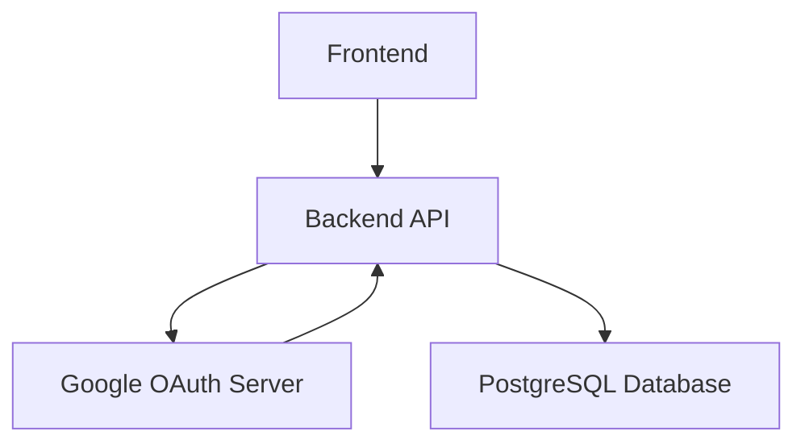

# Itemize.cloud OAuth Implementation Overview

## Introduction

Itemize.cloud uses Google OAuth 2.0 for user authentication, providing a secure and convenient way for users to sign in without managing separate credentials. This document outlines the implementation details of the OAuth flow.

## Authentication Architecture



## Google OAuth Implementation

### OAuth Configuration

#### Environment Variables
```env
VITE_GOOGLE_CLIENT_ID=your_google_client_id.apps.googleusercontent.com
```

### Frontend Integration (`@react-oauth/google`)

```typescript
// src/App.tsx (or similar entry point)
import { GoogleOAuthProvider } from '@react-oauth/google';

function App() {
  return (
    <GoogleOAuthProvider clientId={import.meta.env.VITE_GOOGLE_CLIENT_ID}>
      {/* Your application components */}
    </GoogleOAuthProvider>
  );
}

export default App;
```

```typescript
// src/components/Auth/GoogleLoginButton.tsx
import { useGoogleLogin } from '@react-oauth/google';
import axios from 'axios';

const GoogleLoginButton = () => {
  const login = useGoogleLogin({
    onSuccess: async (tokenResponse) => {
      try {
        const res = await axios.post('/api/auth/google-login', {
          token: tokenResponse.access_token,
        });
        // Handle successful login (e.g., store JWT, redirect)
        console.log('Login successful:', res.data);
      } catch (error) {
        console.error('Backend login failed:', error);
      }
    },
    onError: (errorResponse) => console.error('Google login failed:', errorResponse),
  });

  return (
    <button onClick={() => login()}>
      Sign in with Google
    </button>
  );
};

export default GoogleLoginButton;
```

### Backend Authentication (`src/auth.js`)

```javascript
// src/auth.js
const { OAuth2Client } = require('google-auth-library');
const jwt = require('jsonwebtoken');
const express = require('express');
const router = express.Router();

const client = new OAuth2Client(process.env.VITE_GOOGLE_CLIENT_ID);

router.post('/google-login', async (req, res) => {
  const { token } = req.body;

  try {
    const ticket = await client.verifyIdToken({
      idToken: token,
      audience: process.env.VITE_GOOGLE_CLIENT_ID,
    });
    const payload = ticket.getPayload();
    const { sub, email, name, picture } = payload;

    // Check if user exists in DB, if not, create new user
    let user = await req.dbPool.query('SELECT * FROM users WHERE provider_id = $1 AND provider = 'google'', [sub]);
    if (user.rows.length === 0) {
      user = await req.dbPool.query(
        'INSERT INTO users (email, name, avatar_url, provider, provider_id) VALUES ($1, $2, $3, $4, $5) RETURNING *'
        , [email, name, picture, 'google', sub]
      );
    }

    const jwtToken = jwt.sign({ id: user.rows[0].id, email: user.rows[0].email }, process.env.JWT_SECRET, { expiresIn: '7d' });
    res.json({ token: jwtToken, user: user.rows[0] });

  } catch (error) {
    console.error('Google login error:', error);
    res.status(401).json({ message: 'Authentication failed' });
  }
});

// JWT verification middleware
const authenticateJWT = (req, res, next) => {
  const authHeader = req.headers.authorization;

  if (authHeader) {
    const token = authHeader.split(' ')[1];

    jwt.verify(token, process.env.JWT_SECRET, (err, user) => {
      if (err) {
        return res.sendStatus(403); // Forbidden
      }
      req.user = user;
      next();
    });
  } else {
    res.sendStatus(401); // Unauthorized
  }
};

module.exports = { router, authenticateJWT };
```

## Security Considerations

- **Token Validation**: ID tokens are verified on the backend to ensure authenticity and prevent tampering.
- **JWT Secret**: The `JWT_SECRET` is stored securely as an environment variable.
- **HTTPS**: All communication is over HTTPS to protect tokens in transit.
- **Token Expiration**: JWTs have a defined expiration time, and refresh tokens are used for long-lived sessions.

## Future Enhancements

- **Multi-Factor Authentication (MFA)**: Implement additional layers of security for user accounts.
- **Support for Other OAuth Providers**: Integrate with other providers like GitHub or traditional email/password.
