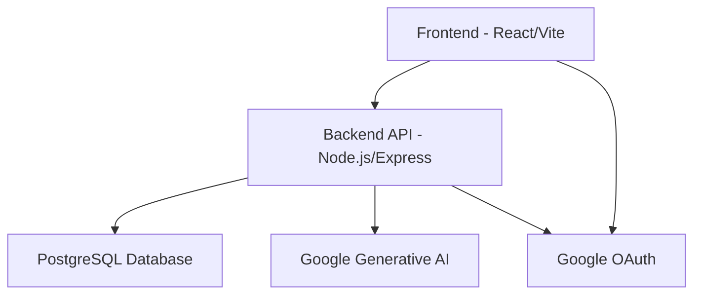

# Itemize.cloud Architecture Overview

The Itemize.cloud application follows a client-server architecture with a clear separation between the frontend and backend services.

## System Architecture

## Key Components

### Frontend (React/Vite)
- **React**: Core UI library for building interactive user interfaces.
- **Vite**: Fast build tool and development server for a smooth development experience.
- **Shadcn/ui**: Component library for building accessible and customizable UI elements.
- **React Query**: Manages server state and data fetching, caching, and synchronization.
- **React Rnd**: Enables resizable and draggable components for canvas-based features.
- **React Sketch Canvas**: Provides drawing capabilities for the whiteboard feature.

### Backend (Node.js/Express)
- **Node.js**: JavaScript runtime environment for server-side logic.
- **Express.js**: Web application framework for building robust APIs.
- **PostgreSQL**: Relational database for persistent data storage.
- **pg**: Node.js client for PostgreSQL.
- **Sequelize**: ORM (Object-Relational Mapper) for interacting with the PostgreSQL database.
- **jsonwebtoken**: Library for implementing JWT-based authentication.

### External Services
- **Google OAuth**: Handles user authentication and authorization.
- **Google Generative AI**: Provides AI-powered suggestions for list items.

## Key Features

### Item Management
- Create, read, update, and delete lists, notes, and whiteboards.
- Organize items with custom categories.

### Canvas View
- Drag-and-drop functionality for lists, notes, and whiteboards.
- Resizable components for flexible layout.
- Free-form drawing on whiteboards.

### AI Suggestions
- Generate intelligent suggestions for list items based on context.

## Architecture Principles

1. **Client-Server Separation**: Clear distinction between frontend and backend responsibilities.
2. **API-First Design**: Backend exposes a well-defined RESTful API for all data operations.
3. **Modularity**: Components are designed to be independent and reusable.
4. **Scalability**: Designed to handle increasing user loads and data volumes.
5. **Security**: Implements robust authentication and authorization mechanisms.
